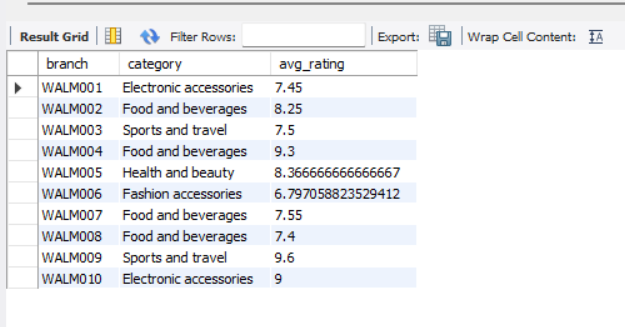
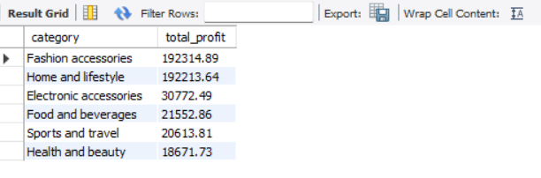
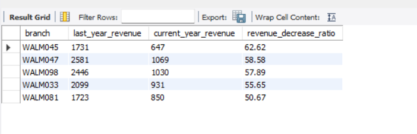
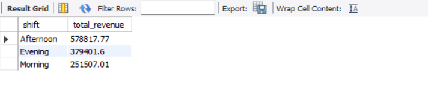

# Walmart Sales Data Analysis using Python and MySQL

## Overview

This project presents an end-to-end sales data analysis of Walmart transactions using **Python** for data cleaning and **MySQL** for business analysis.

The workflow begins with cleaning and preparing the raw dataset using **Pandas**, followed by importing the cleaned data into MySQL to answer business-focused questions through SQL queries.

The project helped me strengthen my understanding of data cleaning, SQL analysis, and organizing a complete analytics project using Git and GitHub.


---

## Tools & Technologies

- Python
- Pandas
- Jupyter Notebook
- MySQL
- MySQL Workbench
- Git
- GitHub
- Business Analysis

---

## Key Insights

- Food & Beverages received the highest average customer ratings.
- Health & Beauty generated one of the highest profits.
- Payment preferences varied across branches.
- Revenue trends were analyzed across multiple years.

---

## Dataset

The dataset contains Walmart sales transactions with details such as:

- Invoice ID
- Branch
- City
- Product Category
- Unit Price
- Quantity
- Payment Method
- Customer Rating
- Date & Time
- Profit Margin

---

## Data Cleaning using Python

The raw dataset was cleaned using **Python (Pandas)** before loading it into MySQL.

The cleaning process included:

- Loading the dataset
- Checking for missing values
- Removing duplicate records
- Converting columns to appropriate data types
- Cleaning the `unit_price` column
- Exporting the cleaned dataset for SQL analysis

The complete cleaning process is available in:

```text
notebook/project.ipynb
```

---

## SQL Analysis

After importing the cleaned dataset into MySQL, SQL queries were written to answer business-related questions.

The analysis covers:

- Payment method analysis
- Highest-rated product category by branch
- Busiest day for each branch
- Quantity sold by payment method
- Product category ratings across cities
- Profit generated by each category
- Preferred payment method by branch
- Sales by Morning, Afternoon and Evening shifts
- Branches with the highest year-over-year revenue decrease
- Revenue generated by each sales shift (custom analysis)

The SQL scripts are available inside the **sql** folder.

---

## SQL Concepts Used

This project demonstrates the use of:

- SELECT
- WHERE
- GROUP BY
- ORDER BY
- Aggregate Functions
- CASE Statements
- JOIN
- Common Table Expressions (CTEs)
- Window Functions
- RANK()
- Date Functions
- CAST()
- REPLACE()

---

## Project Structure

```text
Walmart_SQL_Python/
│
├── data/
│   ├── Walmart.csv
│   └── walmart_clean_data.csv
│
├── notebook/
│   └── project.ipynb
│
├── sql/
│   ├── MySQL Queries.sql
│   └── PSQL Queries.sql
│
├── docs/
│   └── Walmart Business Problems.pdf
│
├── screenshots/
│   ├── q2_highest_rating.png
│   ├── q6_total_profit.png
│   ├── q9_revenue_drop.png
│   └── q10_shift_revenue.png
│
├── README.md
└── requirements.txt
```

---

# Results

## Highest Rated Product Category by Branch



---

## Total Profit by Product Category



---

## Branches with Highest Revenue Decrease



---

## Revenue Generated by Sales Shift



---

## Key Insights

Some of the insights obtained from the analysis include:

- Food and Beverages consistently received high customer ratings.
- Customer payment preferences varied across different branches.
- Product profitability differed significantly across categories.
- A few branches experienced a noticeable decline in revenue compared to the previous year.
- Customer purchase activity varied across different times of the day.

---

## Skills Demonstrated

Through this project, I gained practical experience in:

- Data Cleaning using Python (Pandas)
- SQL Query Writing
- Data Aggregation and Business Analysis
- Window Functions
- Common Table Expressions (CTEs)
- Data Import into MySQL
- Git and GitHub for project version control

---

## Future Improvements

Some possible enhancements for this project include:

- Building an interactive Power BI dashboard using the same dataset.
- Creating visualizations using Matplotlib or Seaborn.
- Performing sales forecasting using Python.
- Automating the ETL process for larger datasets.

---

## Author

**Eshika Das**

If you have any feedback or suggestions, feel free to connect with me.
